# Weather App

Weather App is a single-page client–server Android application that displays a 3-day weather forecast for a given location.

## Overview

The application determines the user's location using three different approaches:

1. **Initial location detection**  
   An approximate location is determined based on the user's IP address.

2. **Manual location input**  
   The user can enter a location name, which is resolved using the Google Geocode API.

3. **Current device location**  
   The precise location is obtained using the Fused Location Provider Client.

The application gracefully handles error scenarios by displaying appropriate notifications and allowing the user to retry requests.

## Data Handling

The app follows an **Offline First** approach.  
This allows access to locally cached data when network requests fail.

The application also supports **pull-to-refresh** functionality to explicitly request updated weather data from the server.

## Architecture

The project follows **Clean Architecture** principles and Google-recommended Android best practices:

- Business logic is isolated in **domain layers**
- **Data layers** contain concrete implementations of repositories and data sources
- Domain entities are aggregated into **components** that expose use cases
- **Features** represent the presentation layer and operate on use cases to manage UI state and user interactions

## Project Structure

### `:app`
Application entry point. Sets up dependency injection, navigation, and connects feature modules.

### `:core`
Core modules shared across the application.

#### `:core:data`
Common data-layer implementations and abstractions used across features.

#### `:core:domain`
Core business logic. Defines domain models, use cases, and repository contracts.

#### `:core:presentation`
Shared presentation utilities, base UI components, and common presentation logic.

#### `:core:navigation`
Navigation contracts and feature entry points.

### `:data`
Domain-specific business logic and its data-layer implementations.

#### `:data:weather_forecast`
Weather forecast domain models, use cases, and data implementations.

#### `:data:location`
Location-related domain models and data implementations.

#### `:data:geocode`
Domain models and data implementations for Google Geocode API results.

### `:component`
Application-level components that aggregate domain logic and expose use cases.

#### `:component:weather_forecast`
Weather forecast data orchestration component.

#### `:component:location`
Location input and geolocation handling component.

### `:feature`
UI features of the application.  
Each feature consists of:
- `:ui` — visual implementation
- `:definition` — feature identifier used for navigation and decoupling

#### `:feature:weather_forecast`
Main screen displaying the weather forecast.

#### `:feature:location`
Location input and device geolocation feature.

### `:build-logic`
Shared Gradle convention plugins and build configuration.

### `:buildSrc`
Shared build logic for the project.

## Tech Stack

- Android SDK
- Kotlin
- Jetpack Compose
- Material Design 3
- Location Services  
  - Fused Location Provider Client  
  - Google Geocode API
- Retrofit
- Moshi
- Coroutines / Flow
- DataStore
- Koin
- Coil
- MVI
- Clean Architecture
- Gradle Multimodule architecture
- Detekt

## Media

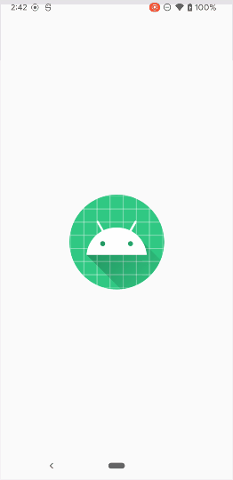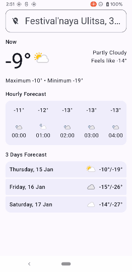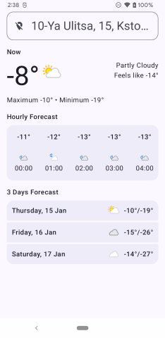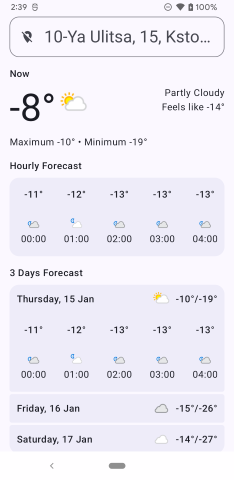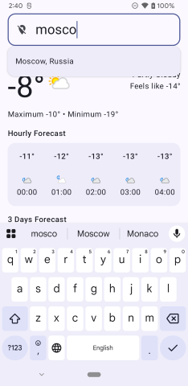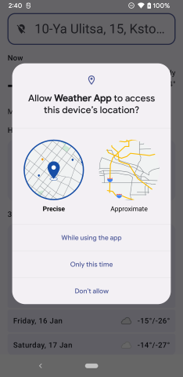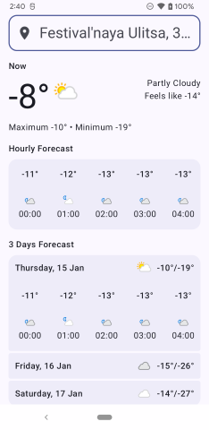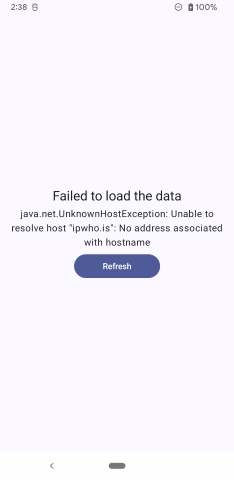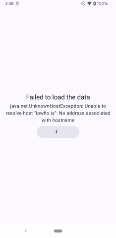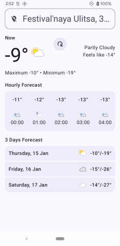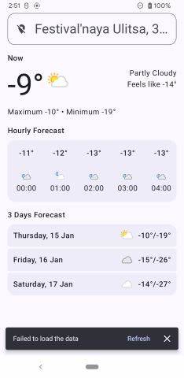
